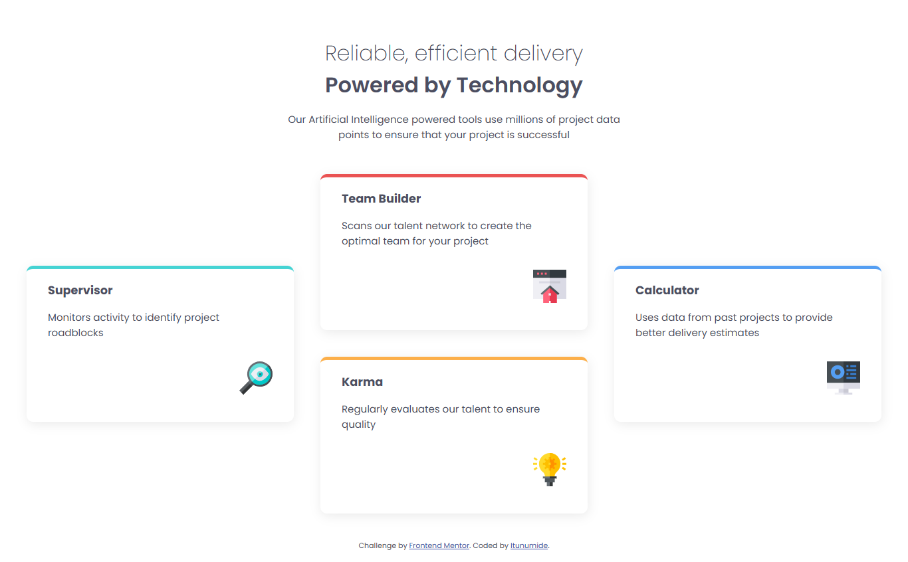

# Frontend Mentor - Four card feature section solution

This is a solution to the [Four card feature section challenge on Frontend Mentor](https://www.frontendmentor.io/challenges/four-card-feature-section-weK1eFYK). Frontend Mentor challenges help you improve your coding skills by building realistic projects.

## Table of contents

- [Overview](#overview)
  - [The challenge](#the-challenge)
  - [Screenshot](#screenshot)
  - [Links](#links)
- [My process](#my-process)
  - [Built with](#built-with)
  - [What I learned](#what-i-learned)
  - [Continued development](#continued-development)
  - [Useful resources](#useful-resources)
- [Author](#author)
- [Acknowledgments](#acknowledgments)

## Overview

### The challenge

Users should be able to:

- View the optimal layout for the site depending on their device's screen size

### Screenshot

### Links

- Solution URL: [Add solution URL here]https://github.com/itunumide/four-card-feature-section)
- Live Site URL: [Add live site URL here](https://four-card-feature-section-gamma-pied.vercel.app)

## My process

### Built with

-- Semantic HTML5

- CSS Custom Properties (variables)
- Flexbox
- CSS Grid (used in responsive layout)
- Mobile-first workflow

### What I learned

- How to use CSS Grid for overlapping/stacked layouts.
- How to apply different top border colors using BEM or utility classes.
- How to use CSS variables to manage consistent color theming.
- How to make responsive card layouts from mobile to desktop using media queries.

### Continued development

- Improve responsiveness with container queries.
- Add animations or hover effects to each card.
- Extract reusable utility classes for faster prototyping.
- Explore a framework like Tailwind CSS to compare utility-first approaches.

### Useful resources

- [Frontend Mentor Guide](https://www.frontendmentor.io/resources) – for general tips and community insights.
- [CSS Tricks - nth-child](https://css-tricks.com/almanac/selectors/n/nth-child/) – helped me style specific cards.
- [MDN Grid Docs](https://developer.mozilla.org/en-US/docs/Web/CSS/CSS_grid_layout) – refreshed my knowledge of grid layout.

## Author

- Website - (https://itunu-i-raji.vercel.app/)
- Frontend Mentor - 
- Twitter - 

## Acknowledgments

Thanks to the Frontend Mentor community and documentation. Inspiration from other submissions helped refine structure and card placement.
